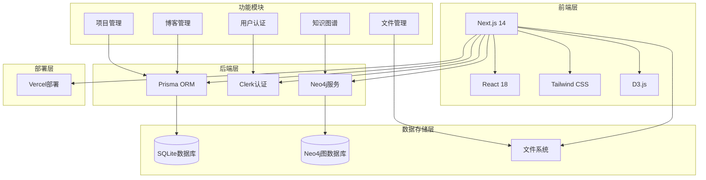

# Cattail.me 系统架构图

## 架构说明

### 前端层
- **Next.js 14**: 作为主要的应用框架，提供SSR和SSG功能
- **React 18**: 用于构建用户界面
- **Tailwind CSS**: 提供样式支持
- **D3.js**: 用于构建知识图谱可视化

### 后端层
- **Prisma ORM**: 处理 SQLite 数据库操作
- **Neo4j 服务**: 处理图数据库操作
- **Clerk**: 处理用户认证和授权

### 数据存储层
- **SQLite**: 存储博客内容、用户数据等结构化数据
- **Neo4j**: 存储和管理知识图谱数据
- **文件系统**: 存储上传的图片和其他静态资源

### 部署层
- **Vercel**: 提供自动部署和性能监控

### 主要功能模块
1. 博客管理（使用 Prisma + SQLite）
2. 项目管理（使用 Prisma + SQLite）
3. 知识图谱（使用 Neo4j）
4. 文件管理（使用文件系统）
5. 用户认证（使用 Clerk）

## 技术特点
- 采用现代化的技术栈
- 支持服务端渲染和静态生成
- 响应式设计
- 支持暗色模式
- 高性能的数据处理
- 安全的用户认证

## 数据库说明
- **SQLite + Prisma**: 用于存储博客文章、项目信息等结构化数据
- **Neo4j**: 专门用于存储和管理知识图谱数据，提供高效的图数据查询能力
- 两个数据库系统相互独立，各自服务于不同的业务需求 