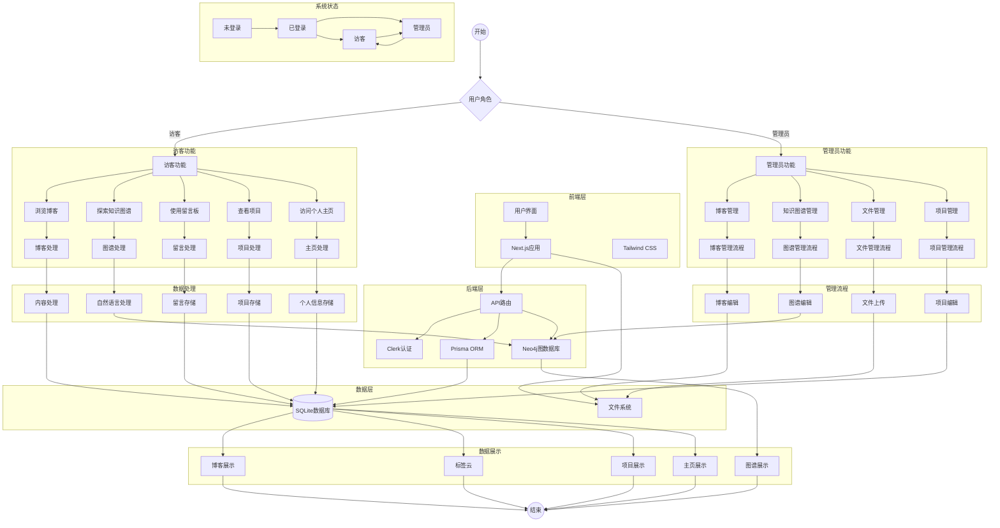

# Cattail.me 系统整合流程图

## 系统完整流程图


## 图例说明

1. **系统层级**
   - 前端层：负责用户界面展示
   - 后端层：处理业务逻辑和数据访问
   - 数据层：存储系统数据

2. **功能模块**
   - 访客功能：面向普通用户的功能
   - 管理员功能：面向管理员的功能
   - 数据处理：系统内部的数据处理流程
   - 管理流程：管理员操作的处理流程
   - 数据展示：最终的数据展示流程

3. **状态转换**
   - 未登录 -> 已登录：用户认证
   - 已登录 -> 访客/管理员：权限分配
   - 访客 <-> 管理员：权限变更

4. **数据流向**
   - 实线箭头：表示数据流向
   - 虚线箭头：表示控制流向
   - 双向箭头：表示双向交互
``` 