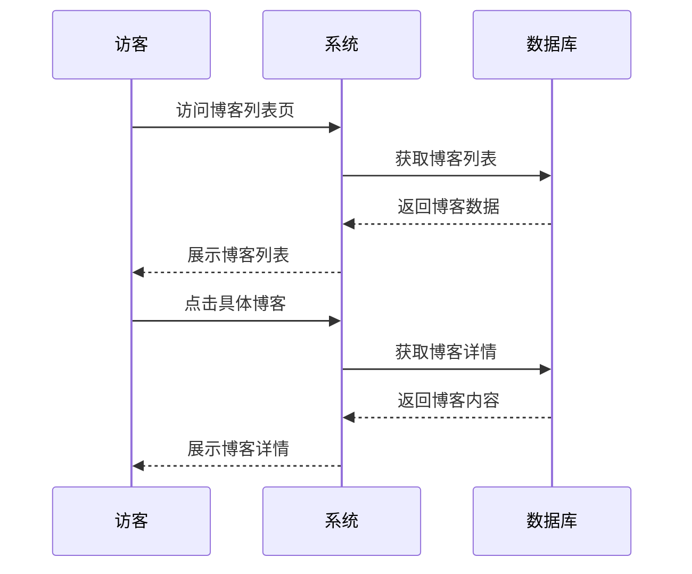
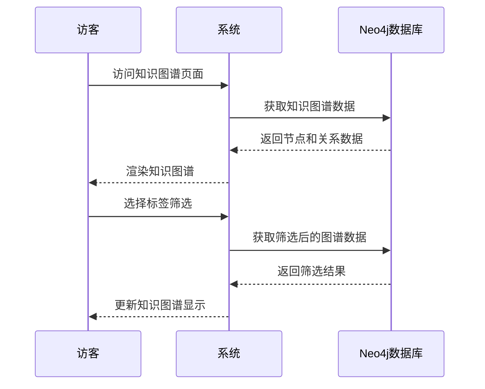
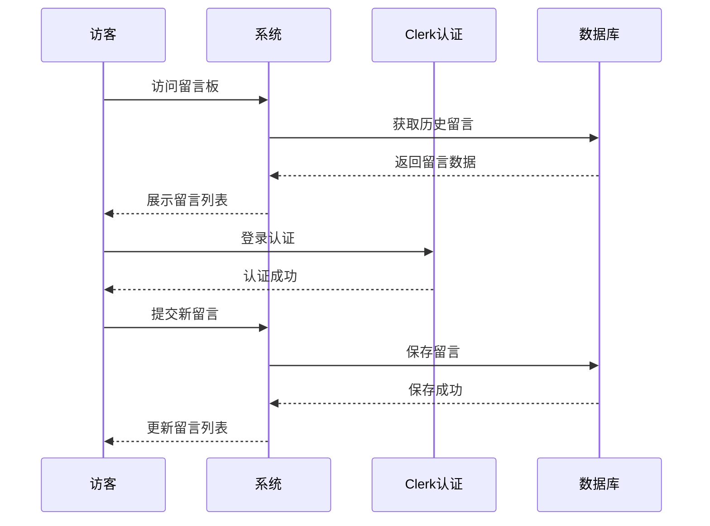
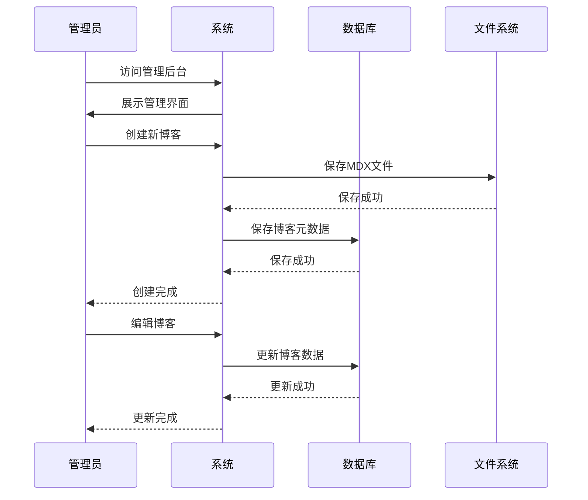
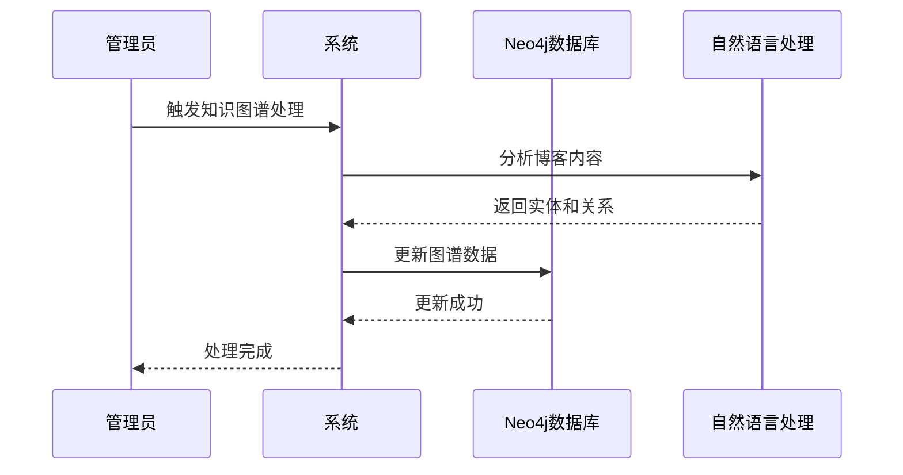
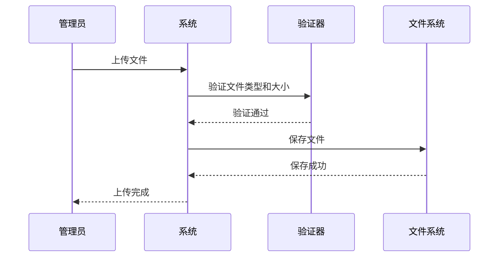
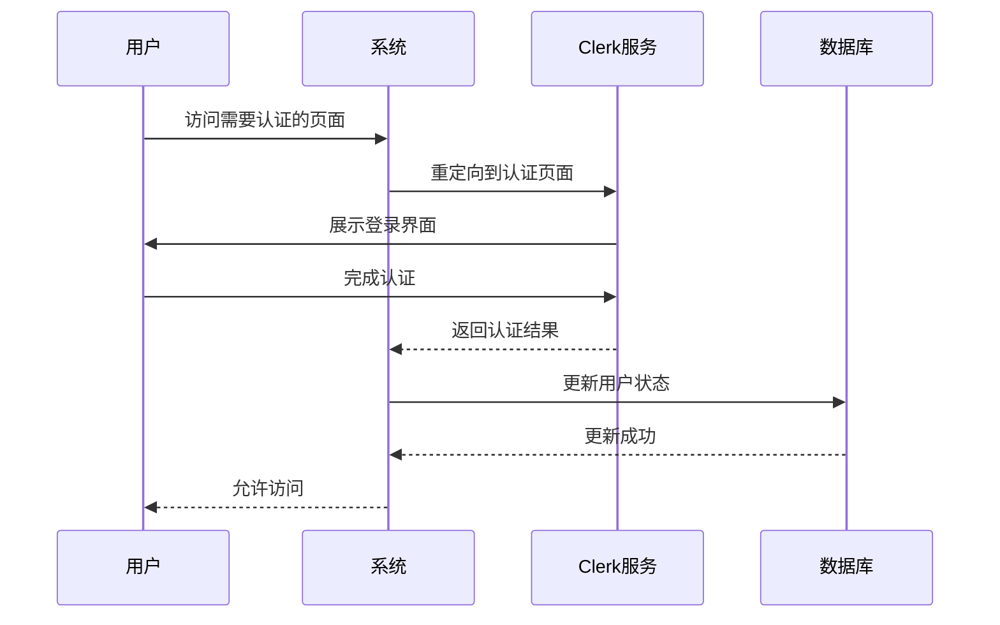

# Cattail.me 系统时序图

## 访客业务流程

### 1. 博客浏览流程

```mermaid
sequenceDiagram
    participant V as 访客
    participant S as 系统
    participant DB as 数据库

    V->>S: 访问博客列表页
    S->>DB: 获取博客列表
    DB-->>S: 返回博客数据
    S-->>V: 展示博客列表

    V->>S: 点击具体博客
    S->>DB: 获取博客详情
    DB-->>S: 返回博客内容
    S-->>V: 展示博客详情
```

### 2. 知识图谱探索流程

```mermaid
sequenceDiagram
    participant V as 访客
    participant S as 系统
    participant DB as Neo4j数据库

    V->>S: 访问知识图谱页面
    S->>DB: 获取知识图谱数据
    DB-->>S: 返回节点和关系数据
    S-->>V: 渲染知识图谱

    V->>S: 选择标签筛选
    S->>DB: 获取筛选后的图谱数据
    DB-->>S: 返回筛选结果
    S-->>V: 更新知识图谱显示
```

### 3. 留言板交互流程

```mermaid
sequenceDiagram
    participant V as 访客
    participant S as 系统
    participant A as Clerk认证
    participant DB as 数据库

    V->>S: 访问留言板
    S->>DB: 获取历史留言
    DB-->>S: 返回留言数据
    S-->>V: 展示留言列表

    V->>A: 登录认证
    A-->>V: 认证成功

    V->>S: 提交新留言
    S->>DB: 保存留言
    DB-->>S: 保存成功
    S-->>V: 更新留言列表
```

## 管理员业务流程

### 1. 博客管理流程

```mermaid
sequenceDiagram
    participant A as 管理员
    participant S as 系统
    participant DB as 数据库
    participant FS as 文件系统

    A->>S: 访问管理后台
    S->>A: 展示管理界面

    A->>S: 创建新博客
    S->>FS: 保存MDX文件
    FS-->>S: 保存成功
    S->>DB: 保存博客元数据
    DB-->>S: 保存成功
    S-->>A: 创建完成

    A->>S: 编辑博客
    S->>DB: 更新博客数据
    DB-->>S: 更新成功
    S-->>A: 更新完成
```

### 2. 知识图谱管理流程

```mermaid
sequenceDiagram
    participant A as 管理员
    participant S as 系统
    participant DB as Neo4j数据库
    participant N as 自然语言处理

    A->>S: 触发知识图谱处理
    S->>N: 分析博客内容
    N-->>S: 返回实体和关系
    S->>DB: 更新图谱数据
    DB-->>S: 更新成功
    S-->>A: 处理完成
```

### 3. 文件管理流程

```mermaid
sequenceDiagram
    participant A as 管理员
    participant S as 系统
    participant V as 验证器
    participant FS as 文件系统

    A->>S: 上传文件
    S->>V: 验证文件类型和大小
    V-->>S: 验证通过
    S->>FS: 保存文件
    FS-->>S: 保存成功
    S-->>A: 上传完成
```

## 系统集成流程

### 1. 用户认证流程

```mermaid
sequenceDiagram
    participant U as 用户
    participant S as 系统
    participant C as Clerk服务
    participant DB as 数据库

    U->>S: 访问需要认证的页面
    S->>C: 重定向到认证页面
    C->>U: 展示登录界面
    U->>C: 完成认证
    C-->>S: 返回认证结果
    S->>DB: 更新用户状态
    DB-->>S: 更新成功
    S-->>U: 允许访问
``` 