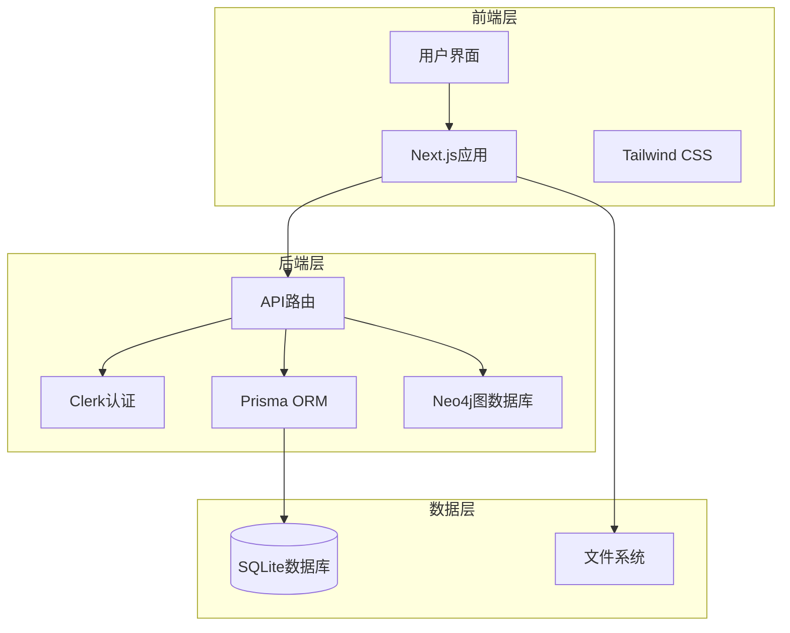
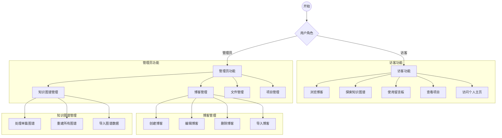
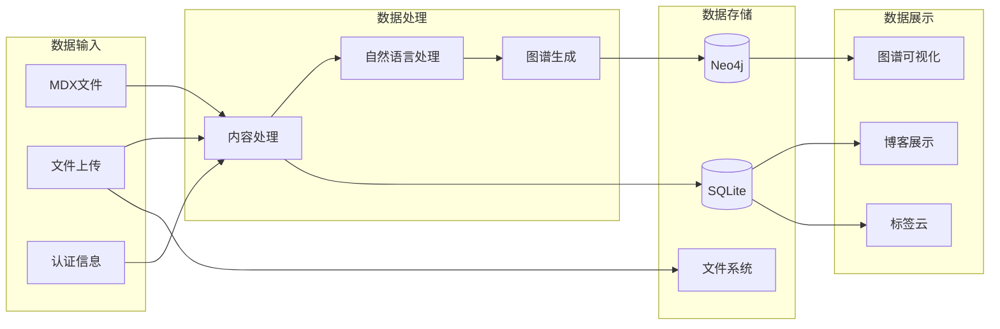
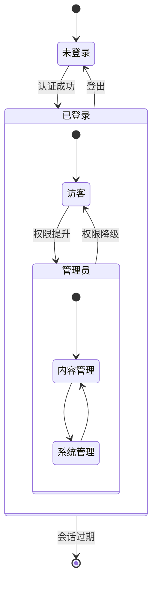

# Cattail.me 系统流程图

## 系统整体架构图

```mermaid
graph TB
    subgraph 前端层
        UI[用户界面]
        Next[Next.js应用]
        Tailwind[Tailwind CSS]
    end

    subgraph 后端层
        API[API路由]
        Auth[Clerk认证]
        Prisma[Prisma ORM]
        Neo4j[Neo4j图数据库]
    end

    subgraph 数据层
        SQLite[(SQLite数据库)]
        FileSystem[文件系统]
    end

    UI --> Next
    Next --> API
    API --> Auth
    API --> Prisma
    API --> Neo4j
    Prisma --> SQLite
    Next --> FileSystem
```

## 系统主要功能流程图

```mermaid
graph TB
    Start((开始)) --> Role{用户角色}
    
    Role -->|访客| Visitor[访客功能]
    Role -->|管理员| Admin[管理员功能]
    
    subgraph 访客功能
        Visitor --> V1[浏览博客]
        Visitor --> V2[探索知识图谱]
        Visitor --> V3[使用留言板]
        Visitor --> V4[查看项目]
        Visitor --> V5[访问个人主页]
    end
    
    subgraph 管理员功能
        Admin --> A1[博客管理]
        Admin --> A2[知识图谱管理]
        Admin --> A3[文件管理]
        Admin --> A4[项目管理]
    end
    
    subgraph 博客管理
        A1 --> B1[创建博客]
        A1 --> B2[编辑博客]
        A1 --> B3[删除博客]
        A1 --> B4[导入博客]
    end
    
    subgraph 知识图谱管理
        A2 --> K1[处理单篇图谱]
        A2 --> K2[重建所有图谱]
        A2 --> K3[导入图谱数据]
    end
```

## 数据流转图

```mermaid
graph LR
    subgraph 数据输入
        MDX[MDX文件]
        Upload[文件上传]
        Auth[认证信息]
    end
    
    subgraph 数据处理
        Process[内容处理]
        NLP[自然语言处理]
        Graph[图谱生成]
    end
    
    subgraph 数据存储
        SQLite[(SQLite)]
        Neo4j[(Neo4j)]
        FS[文件系统]
    end
    
    subgraph 数据展示
        Blog[博客展示]
        GraphViz[图谱可视化]
        TagCloud[标签云]
    end
    
    MDX --> Process
    Upload --> Process
    Auth --> Process
    
    Process --> NLP
    NLP --> Graph
    
    Process --> SQLite
    Graph --> Neo4j
    Upload --> FS
    
    SQLite --> Blog
    Neo4j --> GraphViz
    SQLite --> TagCloud
```

## 系统状态转换图

```mermaid
stateDiagram-v2
    [*] --> 未登录
    未登录 --> 已登录: 认证成功
    已登录 --> 未登录: 登出
    
    state 已登录 {
        [*] --> 访客
        访客 --> 管理员: 权限提升
        管理员 --> 访客: 权限降级
    }
    
    state 管理员 {
        [*] --> 内容管理
        内容管理 --> 系统管理
        系统管理 --> 内容管理
    }
    
    已登录 --> [*]: 会话过期
``` 